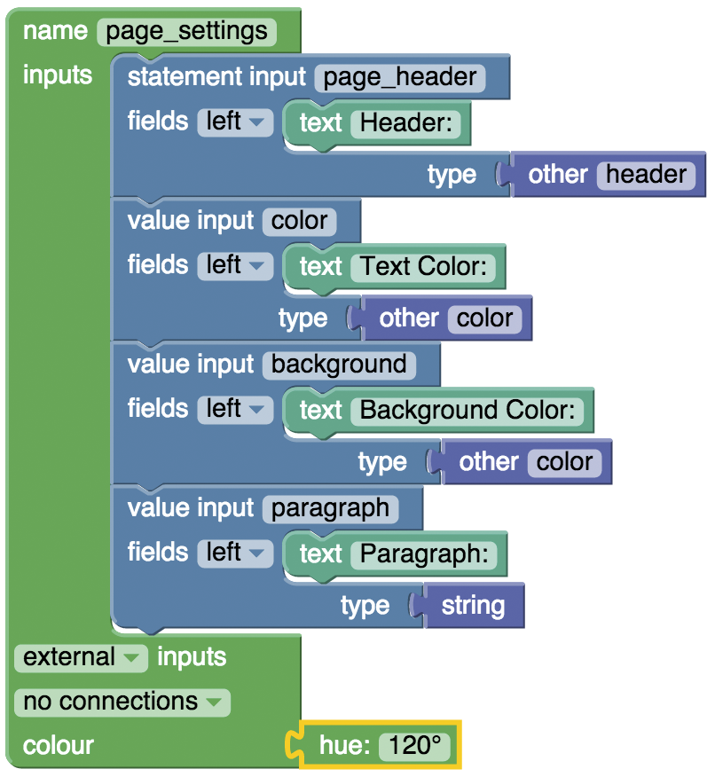
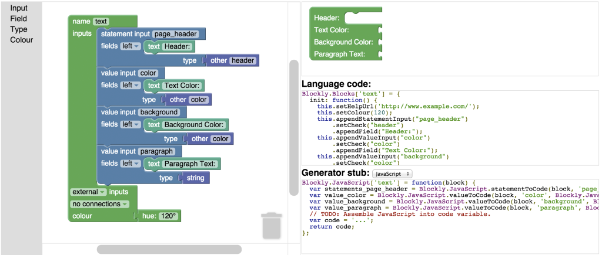
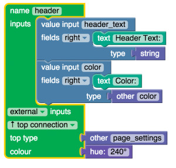
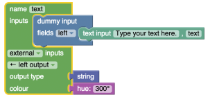
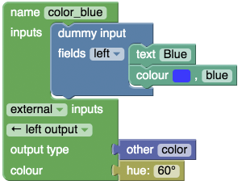

# Build a Visual Programming Editor with Blockly

This tutorial will walk you through the steps of creating a web-based visual programming editor from scratch using Blockly. You will learn how to integrate a resizable Blockly interface into a webpage, create custom blocks, and generate some JavaScript. You will create a Blockly editor that can modify the look and feel of the current webpage. The user will be able to use blocks to change the site colors and edit the header text.

See the completed example at: http://jlcreations.com/blockly-page-editor/

## Index
* [Working Example and Tutorial Files](#working-example-and-tutorial-files)
* [Get Blockly](#get-blockly)
* [Start Creating the Page Editor](#start-creating-the-page-editor)
* [Create Custom Blocks](#create-custom-blocks)
* [Setup the Toolbox](#setup-the-toolbox)
* [Default Blocks on the Stage](#default-blocks-on-the-stage)
* [Test the Blockly Editor](#test-the-blockly-editor)
* [Write the Javascript Generator](#write-the-javascript-generator)
* [Test the Generated Javascript](#test-the-generated-javascript)
* [Further Reading](#further-reading)


## Working Example and Tutorial Files

You can view the finished project online at:
http://jaelle.github.io/blockly-page-editor 

The files for this tutorial are available on GitHub.
https://github.com/jaelle/blockly-page-editor

## Get Blockly

Before you get started, make sure to download Blockly. There are several ways to go about this.
* Download the [zip file](https://github.com/google/blockly/zipball/master).
* Clone the project from git.
  `git clone https://github.com/google/blockly.git blockly`
  
## Start Creating the Page Editor

Now it is time to design the page editor. This webpage will be editable by a Blockly editor contained in the page. It is made up of several parts.

* HTML
  * Webpage (/index.html)
  * Blockly Editor (/blockly.html)
* Styles (/styles.css)
  * Javascript
    * Blockly (/blockly/blockly_uncompressed.js)
    * Blockly Language Support (/blockly/msg/js/en.js)
    * Blockly JavaScript Generator (/blockly/generators/javascript.js)
    * Custom blocks (/blocks.js)
    * Custom block javascript generator (/javascript.js)

Start by creating the HTML page (/index.html). Make it look something like the code found here:
https://github.com/jaelle/blockly-page-editor/blob/gh-pages/index.html 

Next, create the HTML page for Blockly (/blockly.html). This will run in the iframe of index.html. More information about creating a Blockly editor in an iframe can be found on the [Blockly Developer site](https://developers.google.com/blockly/custom-blocks/block-factory). Make sure it looks something like this:
https://github.com/jaelle/blockly-page-editor/blob/gh-pages/blockly.html
 

Add some styles. An example stylesheet can be found here:
https://github.com/jaelle/blockly-page-editor/blob/gh-pages/styles.css

Visiting /index.html in the browser should reveal the Blockly editor loaded on the page. Several default blocks are loaded into the Blockly editor.  However, we want to create our own custom blocks for editing the page.

## Create Custom Blocks

Visit the Block Factory demo app in your browser. To view this locally, navigate to: blockly/demos/blockfactory/index.html

Note: When working with the Block Factory, you may receive an error that says “Unable to communicate between frames.” If this occurs, you will need to use another browser, such as Firefox, to run Block Factory locally on your computer. Alternatively, you can also visit the Block Factory online at: https://blockly-demo.appspot.com/static/demos/blockfactory/index.html

Use the Block Factory to design custom blocks. Language templates for a custom block and its associated code generator can be created on this page. The left hand side of the screen contains code blocks for setting options of a new custom block. A preview of the new block displays on the upper right hand side of the screen. Below that is a template for the block’s code and the generated JavaScript.

More information about using the Block Factory can be found on the Blockly Developer site.

Create a custom block to hold our page settings. Make it look like the image below. You will be able to find all required blocks under each of the menu items in the left hand toolbar.



Once your custom block is created, your screen should look something like the image below. Copy the code from below Language code and paste it into a file called /blocks.js. Copy the code from below Generator stub and paste it into a file called /javascript.js.



Repeat this step for each of the following blocks and continue to copy and paste the generated code templates into /blocks.js and /javascript.js.





Create as many different color blocks as you feel like making, and continue to add the generated code templates to blocks.js and javascript.js



## Setup the Toolbox

Once all your blocks have been created, you are ready to add them to the Blockly editor’s toolbox. This can be done in the Blockly file (/blockly.html).

Find the following lines:

```xml
<xml id=”toolbox” style=”display: none”> </xml>
```

Replace these with the categories and blocks you want in your toolbox. One example is:

```xml
<xml id=”toolbox” style=”display: none”>`
  <category name=”Page Parts”>`
    <block type=”page_header”></block>
    <block type=”page_text”></block>
 </category>
<category name=”Color”>
    <block type=”color_red”></block>
    <block type=”color_green”></block>
    <block type=”color_blue”></block>
  </category>
</xml>
```

Read more about the Toolbox on the [Blockly Developers](https://web.archive.org/web/20161017153920/https://developers.google.com/blockly/custom-blocks/block-factory) site.

## Default Blocks on the Stage

For the purpose of our page editor, we want to start by displaying a the page_settings custom block on the Blockly editor stage. To do this, we need to specify a few options in the init() function in blockly.html. Find this function and modify it to match the following script.

Replace the init() function in /blockly.html:

```javascript
function init() {
  Blockly.inject(document.body, {toolbox: document.getElementById('toolbox')});
  // Let the top-level application know that Blockly is ready.
  window.parent.blockly_loaded(Blockly);
  var root_block = Blockly.Block.obtain(Blockly.mainWorkspace, 'page_settings');
  root_block.initSvg();
  root_block.render();
  root_block.setMovable(false);
  root_block.setDeletable(false);
}
```

## Test the Blockly Editor

Navigate to your /index.html file in a browser to see if everything works as anticipated.

*Troubleshooting Tips:*
* Depending on your settings, Chrome may not allow you to share data between frames when running this site locally. If you receive an error, try using another browser such as Firefox.
* If you find you can’t snap together blocks that you need to, ensure that the parent block has the proper value specified for setCheck(). Also check that the child block is returning the proper Output value.
Example: Both the setCheck and the Output value are “String”
  ```javascript
  this.appendValueInput("page_paragraph")
  .setCheck("String")
  ```

  ```javascript
  this.setOutput(true, "String");
  ```
  
## Write the JavaScript Generator

Now that the Blockly interface is complete, we need to tell Blockly what to do with the blocks when people try to run their program. This involves writing a custom JavaScript generator.

We already started to create this generator in /javascript.js using the code from the generated Generator stub templates in the Block Factory. When viewing this file, you should see a line in each block that looks like:

```javascript
var code = '...';
```

This code variable needs to be replaced with the JavasSript code that is represented by that code block. For example, our page_header custom block needs to set the color and text of the header. The code for this should look like:

```javascript
Blockly.JavaScript['page_header'] = function(block) {
  var value_header_text = Blockly.JavaScript.valueToCode(block, 'header_text', Blockly.JavaScript.ORDER_ATOMIC);
  var value_color = Blockly.JavaScript.valueToCode(block, 'color', Blockly.JavaScript.ORDER_ATOMIC);

  // The code variable contains the javascript that will run when this code block is executed
  var code = 'document.getElementById("header").innerHTML = "' + value_header_text + '";\n';
  code += 'document.getElementById("header").style.color = "' + value_color + '";\n';
  return code;
};
```

Do this for the rest of the custom block generator stubs that you pasted into /javascript.js. In the end, it should look something like the code found here:
https://github.com/jaelle/blockly-page-editor/blob/gh-pages/javascript.js

Read more about creating custom code generators on the Blockly Developer site.

## Test the Generated JavaScript

We are nearly done! The only step left is to include the run function that will handle executing the generated Blockly code. In /index.html, make sure that a run_code() function is included below the init() function.

```javascript
window.run_code = function() {
  code = window.Blockly.JavaScript.workspaceToCode();
  eval(code);
}
```

Now, navigate to /index.html in your browser and have fun editing your page!

## Further Reading

If you want to continue experimenting with Blockly, be sure to check out all the official documentation at: https://developers.google.com/blockly/
